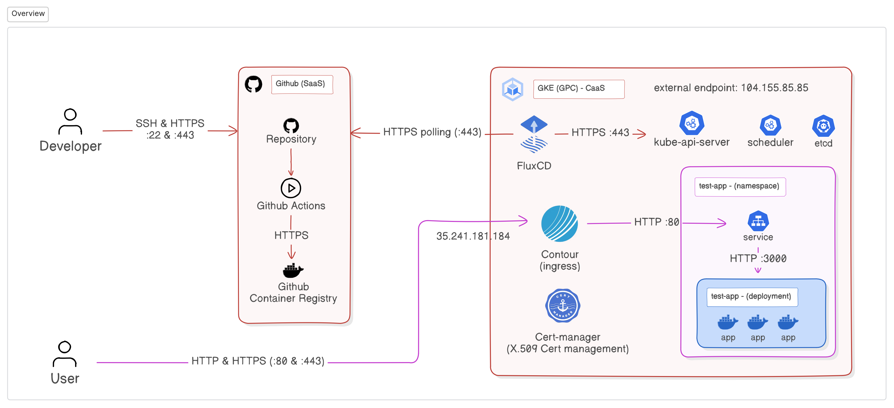
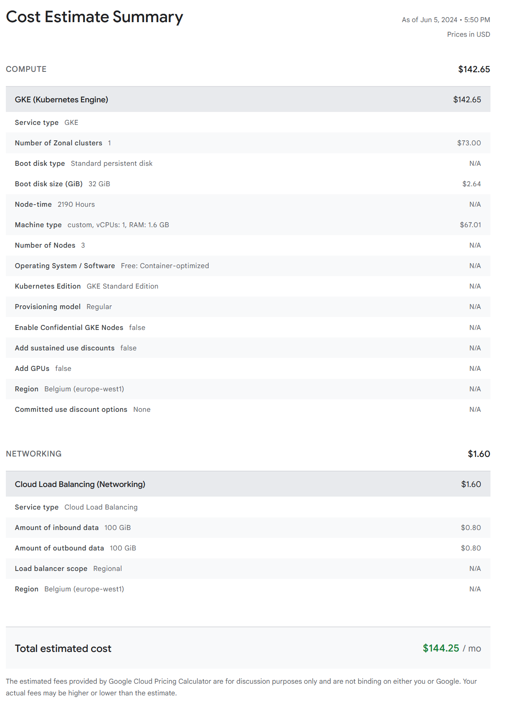

# FluxCD & Kubernetes

## POC objectives

Validate the possible use of FluxCD to implement a continous delivery workflow in the context of an application deployed in a Kubernetes cluster.

We would like to use FluxCD to automatically update a deployment inside a Kubernetes cluster.

## Infra architecture

### Cloud type

The service model of GKE is CaaS (Container-as-a-service).

### Logical components

- A GKE Cluster
- FluxCD installed in the cluster
- The GitHub container registry
- A GitHub action that builds the app's docker image
- A dockerized app

## Schema



## Scenario

### STEP 01 (passing tests)

```
Given: An application

When: A developer pushes new commits on GitHub

Then: A GitHub action builds a docker image for the application that is started
```

### STEP 01 (failing tests)

```
Given: An application

When: A developer pushes new commits on GitHub (with failing tests)

Then: The GitHub action doesn't build the image, FluxCD doesn't pull the new image, the application isn't updated
```

### STEP 02

```
Given: A FluxCD deployment running inside the GKE cluster

When: FluxCD detects changes

Then: FluxCD updates the application deployment with the new docker image
```

## Cost

### GitHub

We use GitHub Actions to test and build the application. You can find more information about the GitHub Action pricing on the [Billing for GitHub Actions](https://docs.github.com/en/billing/managing-billing-for-github-actions/about-billing-for-github-actions) page. You can also find more information about the pricing on the [GitHub Pricing](https://github.com/pricing) page.

We are currently on the free tier which includes 2,000 CI/CD minutes/month.

### GKE

Bellow you can find the price of a GKE cluster with 3 nodes. You can find the cluster configuration in the [setup-cluster.sh](./scripts/setup-cluster.sh) script.



### Options to reduce or adapt costs

- Reduce the number of nodes in the GKE cluster.
- [Add self-hosted runners on GitHub](https://docs.github.com/en/actions/hosting-your-own-runners/managing-self-hosted-runners/about-self-hosted-runners)

## Experience return (Return of experience)

We produced a solution that met all criteria that we established. The solution employs FluxCD to provide continous delivery of an application. This allows the developers to focus on building features and quickly ship by reducing the time to production.

This solution may be adapted in cases where you need a short iteration loop, leading to faster shipping of new features by leveraging Kubernetes and FluxCD without compromising the availability of the service.

Another tool that goes hand-in-hand with FluxCD is [Flagger](https://flagger.app/). Flagger is a _Progressive Delivery Operator for Kubernetes_ that allows :

- Canaries
- A/B Testing
- Blue/Green deployments

Flagger might be an interesting tool to look into following this Workshop.


# For further exploration:
- [Flux's documentation](https://fluxcd.io/flux/), while a bit messy at times, helps you understand some of the harder concepts of this piece of software.
    
    We used the following guides to make this demonstration possible:
    - [How to bootstrap a flux installation on github](https://fluxcd.io/flux/installation/bootstrap/github/)
    - [How to automatically update the flux repository on image update](https://fluxcd.io/flux/guides/image-update/)
    - [Managing helm releases like Contour or cert-manager](https://fluxcd.io/flux/guides/helmreleases/)
    - [How to structure a flux repository](https://fluxcd.io/flux/guides/repository-structure/)

- [Contour's documentation](https://projectcontour.io/) exists at least, and was useful to change some of the annotations for [HTTP -> HTTPS forwarding](https://projectcontour.io/docs/main/config/annotations/).